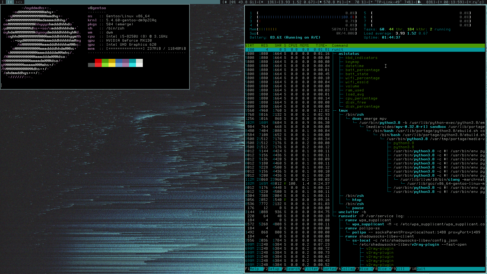

# ASLSTATUS

---
if you found any issues report it here

for all other questions, feel free to ask in matrix
[#aslstatus:matrix.org](https://matrix.to/#/#aslstatus:matrix.org)

---


---
# compile

it is successfully compiling with
* `clang`
* `tcc`
* `gcc`

you can find out more in [config.mk](config.mk)

and add some optimization with uncommenting `LTO` and `OPT`


---
# config

for more info about configs see [config.h](config.h)

also you can change `BUFF_SZ` (see [util.h](util.h))

to use ALSA:
```sh
make AUDIO=ALSA
```
pulseaudio in development (see [there](#pulseaudio))

---
# components/

components were taken from [slstatus](https://tools.suckless.org/slstatus)
and have been modified to work with `pthread`,
some have been completely rewritten

all components are tested in `Linux`

if you are using `OpenBSD` or `FreeBSD`, please tell me if it works correctly,
or if you have any problems


---
### manual updating

just send `USR1` signal to thread which you want to update


---
### how to create you own component

create file with `.c` extension in [components/](components/)

#### basic example

`components/simple_module.c`:
```c
#include "../util.h"  /* you can find some useful functions in `util.c` */

void
function_name(char *out, const char __unused *arg,
		unsigned int __unused interval, void __unused *static_ptr)
{
	bprintf(out, "%s", "Hello, World!");
}
```

`arg`, `interval` and `static_ptr` is optional argument
and if it is unused add `__unused` attribute


then put:
```c
void function_name FUNC_ARGS;
#define function_name {function_name, "thread name", 0}
```

at the end of [aslstatus.h](aslstatus.h)

(`FUNC_ARGS` is already predefined)

#### complex example

`components/my_module.c`:
```c
#include "../util.h"

void
my_module(char *out, const char *arg, unsigned int interval, void *static_ptr)
{
	float *static_data = static_ptr;
	if (!static_data)
		static_data = interval * 20.21;
	
	bprintf(
		out,
		"'%s' module with '%s' arg and '%u' interval, "
		"pointer to static_data is %p with '%f'",
		__FUNCTION__, arg, interval, static_ptr, static_data
	);
}
```

`aslstatus.h`:
```c
/* ... */

void my_module FUNC_ARGS;
#define my_module {my_module, "My Module", sizeof(float)}
```

in `define` third field is size of static data to which point `static_ptr`

also in [os.h](os.h) defined 4 variables which can be used to set
os specific data sizes in branchless way (see: [this lines](https://notabug.org/dm9pZCAq/aslstatus/src/384b798760f5bc333505a5f10cd2ed4b34a91647/aslstatus.h#L40) in [aslstatus.h](aslstatus.h))

---
### pulseaudio
not yet implemented at all with `C` (see [components/volume.c](components/volume.c)),
but you can temporary use `run_command` with `pulse_volume` (see [config.h](config.h))

if anyone can help me with it, then i will gladly accept yours pull requests
(if they don't **suck** to much)

you can find some demo code in [TODO/pulse.c](TODO/pulse.c)

but it has problems using with threads as [component](components/volume.c)


---
# TODO
* rewrite `run_command` to redirect *stderr* to `/dev/null`
* add pulseaudio support
